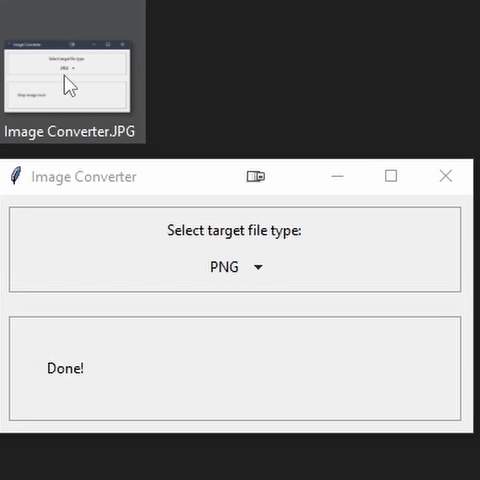

# Image Converter

You have probably experienced downloading an image from the internet and found the image to be a format that doesn't fit your need. I used to use photoshop or gimp to convert them to the format that I needed, but now I just use this image converter.

## How to use

1. Open the program, both versions work in the exact same way, it's just a matter of preference
2. Choose the file format that you want
3. Drop the file or files in the window
4. You're done

Image Converter (Default and minimal)
 

When you use the image converter it will take the file, convert it and save it with the new file extension. If you have a file with the same name (including the file extension), then it will overwrite without asking.
You can also drag multiple files at the same time, the program is made to recognize that it is multiple files and consecutively convert the files to the given format.
I made the program with the idea of fast use, so there is no settings to change in the program, only the file extension. If you need to change the settings for your use, then you are free to do so.
